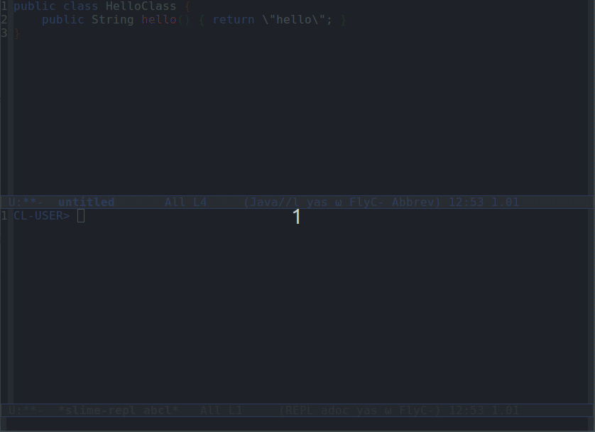

# abcl-memory-compiler
### _Alejandro Zamora Fonseca <allejjandrozf@gmail.com>_

A way to compile Java source code for create Java classes at runtime with ABCL!

Internally it uses the Java library InMemoryJavaCompiler(https://github.com/trung/InMemoryJavaCompiler)
For using it, you will need to run your ABCL instance under a JDK.

ABCL is very good for interact with external Java libraries.
But there are cases when this integration is not enougth.
With this library you have now the maximum flexibility by writing Java code directly to create runtime clases
and this way integrate any Java code with ABCL.

Clone this repository to your Quicklisp discoverable location.

Usage:

```lisp
;; In your .abclrc
;; (require :asdf)
;; (require :abcl-contrib)
;; (require :abcl-asdf)
;; (require :jss)
;; (require :quicklisp-abcl)
CL-USER>
CL-USER> (ql:quickload :abcl-memory-compiler)
To load "abcl-memory-compiler":
  Load 1 ASDF system:
    abcl-memory-compiler
; Loading "abcl-memory-compiler"
[package abcl-memory-compiler]
(:ABCL-MEMORY-COMPILER)

CL-USER> (abcl-memory-compiler:compile-to-class "org.azf.HelloClass"
          "package org.azf;
           public class HelloClass {
                  public String hello() { return \"hello\"; }
           }")
#<java class org.azf.HelloClass>
CL-USER> (jnew *)
#<org.azf.HelloClass org.azf.HelloClass@32eaa91 {57415E14}>
CL-USER> (jcall "hello" *)
"hello"
CL-USER> (abcl-memory-compiler:compile-to-class
          "org.azf.lisp.Funcaller"
          "package org.azf.lisp;
          import org.armedbear.lisp.LispObject;
          public class Funcaller {
                  public LispObject funcall(LispObject obj) {return obj.execute();}
          }")
#<java class org.azf.lisp.Funcaller>
CL-USER> (jnew *)
#<org.azf.lisp.Funcaller org.azf.lisp.Funcaller@23e856d1 {13D049D6}>
CL-USER> (jcall "funcall" * (lambda () 1))
1
CL-USER> (abcl-memory-compiler:compile-to-multiple-classes
          (list (list "A" "public class A{ public B b() { return new B(); }}")
                (list "B" "public class B{ public String toString() { return \"B!\"; }}")))
#<java.util.HashMap {A=class A, B=class B} {367B9E1D}>
CL-USER> ;; Getting the bytecode of the class it can be decompiled or dump to a classfile
CL-USER> (abcl-memory-compiler:compile-to-class "org.azf.HelloClass"
          "package org.azf;
           public class HelloClass {
                  public String hello() { return \"hello\"; }
           }" :get-bytecode t)
#<java class org.azf.HelloClass>
#<jarray [B@d24bf1b {5B4FFCAE}>
CL-USER> (sys::disassemble-bytes
 (nth-value 1 (abcl-memory-compiler:compile-to-class
               "org.azf.HelloClass"
               "package org.azf;
                public class HelloClass {
                    public String hello() { return \"hello\"; }
                }"
               :get-bytecode t)))
"Classfile /tmp/abcl14886829384772253476.class
  Last modified Apr 3, 2024; size 277 bytes
  MD5 checksum 4fe9920b4bf8eadc68c0204ad960303c
  Compiled from \"HelloClass.java\"
public class org.azf.HelloClass
  minor version: 0
  major version: 65
  flags: (0x0021) ACC_PUBLIC, ACC_SUPER
  this_class: #9                          // org/azf/HelloClass
  super_class: #2                         // java/lang/Object
  interfaces: 0, fields: 0, methods: 2, attributes: 1
Constant pool:
   #1 = Methodref          #2.#3          // java/lang/Object.\"<init>\":()V
   #2 = Class              #4             // java/lang/Object
   #3 = NameAndType        #5:#6          // \"<init>\":()V
   #4 = Utf8               java/lang/Object
   #5 = Utf8               <init>
   #6 = Utf8               ()V
   #7 = String             #8             // hello
   #8 = Utf8               hello
   #9 = Class              #10            // org/azf/HelloClass
  #10 = Utf8               org/azf/HelloClass
  #11 = Utf8               Code
  #12 = Utf8               LineNumberTable
  #13 = Utf8               ()Ljava/lang/String;
  #14 = Utf8               SourceFile
  #15 = Utf8               HelloClass.java
{
  public org.azf.HelloClass();
    descriptor: ()V
    flags: (0x0001) ACC_PUBLIC
    Code:
      stack=1, locals=1, args_size=1
         0: aload_0
         1: invokespecial #1                  // Method java/lang/Object.\"<init>\":()V
         4: return
      LineNumberTable:
        line 2: 0

  public java.lang.String hello();
    descriptor: ()Ljava/lang/String;
    flags: (0x0001) ACC_PUBLIC
    Code:
      stack=1, locals=1, args_size=1
         0: ldc           #7                  // String hello
         2: areturn
      LineNumberTable:
        line 3: 0
}
SourceFile: \"HelloClass.java\"
"
CL-USER>
```

Now let's see something more interesting:

Let's say that, for some reason, you need to create a Java runtime class that needs to have a boolean parameter in some method, in this case the java:jnew-runtime-class function can't help you, it has limitations on translating the arguments of methods.

```lisp
CL-USER> (java:jnew-runtime-class
 "Foo"
 :methods (list
           (list "bar" :int '(:boolean)
                 (lambda (this that) (print (list this that)) 23))))
; Evaluation aborted on #<SIMPLE-ERROR {75F08073}>.
CL-USER>
```

On the other hand if you use this library you can do instead:
```lisp
CL-USER> (defparameter *java-code*
      "import org.armedbear.lisp.LispObject;
       import org.armedbear.lisp.Lisp;
       import org.armedbear.lisp.LispThread;
       import org.armedbear.lisp.JavaObject;
       public class Foo {
           public LispObject bar(boolean arg, LispObject obj){
               return Lisp.funcall(obj, new LispObject[]{JavaObject.getInstance(this), JavaObject.getInstance(arg)}, LispThread.currentThread());
           }
       }
       ")
*JAVA-CODE*
CL-USER> (defparameter *foo-java-class* (abcl-memory-compiler:compile-to-class "Foo" *java-code*))
*FOO-JAVA-CLASS*
CL-USER> (jcall "bar" (jnew *foo-java-class*) t (lambda (this that) (print (list this that)) 23))

(#<Foo Foo@19feee8a {19FE365C}> T)
23
CL-USER>
```

And there is even more!

If you want to have a nicer Slime experience you can load the file 'slime-integration.el' in Emacs.
And just run the ELisp function 'compile-java-code-to-abcl' (or the shortcut key 'f5 j') in a buffer with the Java code.
After you type the class name in the minibuffer, in sync with the code in the buffer, the code will be compiled by the function 'abcl-memory-compiler:compile-to-class' and the resulting class object will be inserted directly in the Slime REPL.
See the file 'slime-integration.gif' for a visual explanation.



If you like the library and want some specific commercial support on it or for ABCL in general, I'm available.

I'm offering consulting and development services tailored to help you get the most out of ABCL on the JVM. Whether you need custom development, integration, performance optimization, or training, I’m here to support your project.

Services include:

- Custom application development with ABCL

- Integration of Lisp and Java ecosystems

- Performance optimization and refactoring

- Tailored training and support

Let's Collaborate: If you're looking to enhance your project with ABCL, feel free to reach out and discuss how we can work together.

Contact me at any of the following:

allejjandrozf@gmail.com

https://www.linkedin.com/in/alejandrozamorafonseca/

## License

Apache 2.0 license.
